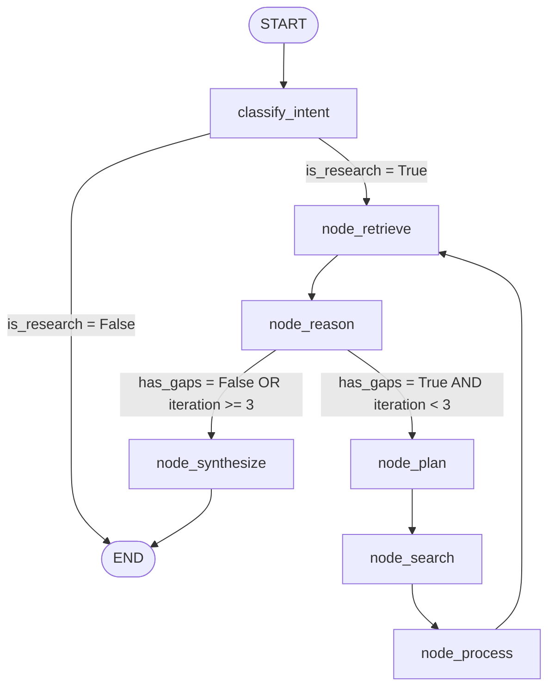

# Architecture Documentation - ResearchMind

ResearchMind is an agentic research assistant built with LangGraph, Streamlit, Pinecone, LangSmith, and Instructor. It uses Groq (Llama-3.3-70b-versatile) as the single LLM provider for all structured reasoning, Perplexity for live web search compilation, and Pinecone for semantic vector caching.

---

## 1. Tech Stack at a Glance

*   **Orchestration:** LangGraph (StateGraph defining clean iterative execution loops).
*   **LLM Provider:** Groq (Meta Llama 3.3 70B model via the OpenAI-compatible Groq API).
*   **Structured Outputs:** Instructor (validates unstructured LLM responses against Pydantic schemas).
*   **Web Search:** Perplexity API (utilizing the new `sonar` online model for search synthesis and inline citations).
*   **Vector Database:** Pinecone (stores and retrieves semantic text chunks).
*   **Observability & Tracing:** LangSmith (automatically monitors LLM calls and trace-wrapped vector database operations).
*   **UI Dashboard:** Streamlit (a custom premium dark-theme interface with live step checklist tracking, metrics, and side-by-side RAG vs Baseline model comparison).

---

## 2. Project Structure

```text
agentic-research-rag/
├── app.py                     # Entrypoint for the Streamlit dashboard, custom CSS, layout, and graph stream consumer.
├── pyproject.toml             # Python package configuration and project dependencies.
├── requirements.txt           # Redirects package installation via pip editable mode (-e .).
├── .env                       # Local environment secrets and key configuration (loaded via python-dotenv).
├── .env.example               # Template containing the environment variables required.
├── scripts/
│   ├── list_models.py         # Utility script to inspect supported models.
│   ├── setup_pinecone.py      # Provisioning script to connect and initialize Pinecone indexes.
│   └── test_gemini_instructor.py # Development scratchpad testing Structured Outputs.
├── src/
│   └── agentic_research_rag/
│       ├── __init__.py        # Package exports.
│       ├── config.py          # Settings model loading env variables using Pydantic Settings.
│       ├── llm_client.py      # Shared OpenAI-compatible client configuration pointing to Groq's API with Tenacity retries.
│       ├── logger.py          # Application logging setup.
│       ├── agent/
│       │   ├── __init__.py    # Module init.
│       │   ├── baseline.py    # Zero-shot non-RAG Baseline LLM execution node.
│       │   ├── graph.py       # LangGraph routing edges, conditional nodes, and stream compiler.
│       │   ├── nodes.py       # Pydantic schemas and LLM prompt templates (Classify, Plan, Reason).
│       │   └── state.py       # Typed schema definition (ResearchState) shared across nodes.
│       ├── evaluation/
│       │   ├── __init__.py    # Module init.
│       │   ├── evaluator.py   # RAG vs Baseline evaluator node.
│       │   └── models.py      # ComparisonResult metrics validation schemas.
│       ├── ingestion/
│       │   ├── __init__.py    # Module init.
│       │   ├── models.py      # Document data schema.
│       │   └── search.py      # Perplexity API integration.
│       ├── pipeline/
│       │   ├── __init__.py    # Module init.
│       │   ├── retriever.py   # Text-embedding-004 query embedding and db search interface.
│       │   └── synthesizer.py # Compilation logic composing context chunks into detailed markdown reports.
│       ├── processing/
│       │   ├── __init__.py    # Module init.
│       │   ├── chunking.py    # Document splitter using RecursiveCharacterTextSplitter.
│       │   ├── embedding.py   # Vector embedding manager utilizing google-generativeai API or dummy vector fallbacks.
│       │   └── models.py      # Chunk data schema.
│       ├── reporting/
│       │   ├── __init__.py    # Module init.
│       │   └── reporter.py    # Local Markdown writer saving output files.
│       └── storage/
│           ├── __init__.py    # Module init.
│           └── pinecone_db.py # Trace-wrapped connection, search, and upload client for Pinecone.
└── tests/                     # Project test suite containing 21 passing unit tests.
```

---

## 3. End-to-End Flow



### Detailed Workflow Step-by-Step

1.  **User Inquiry Input (`app.py`):** The user enters a topic on the Streamlit screen and selects a workflow.
2.  **Intent Classification (`node_classify` in `graph.py`):** Inputs are parsed via `AgentNodes.classify_intent` (in `nodes.py`) and validated against `IntentClassification`. If classified as `not_research`, it bypasses the search cycle and completes immediately.
3.  **Vector DB Cache Query (`node_retrieve` in `graph.py`):** The query vector is generated and searched against the Pinecone DB in a topic-specific namespace (e.g. `what_is_ai_`).
4.  **Reasoning and Completeness Check (`node_reason` in `graph.py`):** The retrieved chunks are evaluated via `AgentNodes.reason_about_context` (in `nodes.py`) to verify if the information is sufficient or has knowledge gaps.
    *   **Loop Decision (`route_after_reason` in `graph.py`):**
        *   If there are **no gaps**, the pipeline routes directly to synthesis (bypassing search/ingestion entirely, i.e., a cache hit).
        *   If **gaps are identified**, and the iteration count is **less than 3**, the graph routes to the **Query Planning** node.
        *   If **gaps are identified** but the iteration count is **equal to or greater than 3**, the search loops are capped to prevent infinite execution, routing directly to synthesis.
5.  **Query Planning (`node_plan` in `graph.py`):** Formulates 3-5 search queries targeting the remaining reasoning gaps.
6.  **Web Search Execution (`node_search` in `graph.py`):** Queries are sent to Perplexity's online API, returning rich synthesis reports.
7.  **Extraction and Vector Ingestion (`node_process` in `graph.py`):** The retrieved pages are chunked, embedded, and uploaded to the Pinecone index.
8.  **Loop Back (`process` -> `retrieve`):** The graph retrieves the complete consolidated database vectors for reasoning evaluation again.
9.  **Report Synthesis (`node_synthesize` in `graph.py`):** Renders the final markdown report with inline source citations.
10. **Evaluation Comparison (`app.py`):** In comparison mode, both RAG output and baseline direct LLM output are displayed side-by-side.

---

## 4. Key Design Decisions

*   **Single LLM Provider (Groq):** A single unified Groq client (`llama-3.3-70b-versatile`) is shared across all nodes to minimize API handshake overhead and simplify rate-limit backoff rules.
*   **Perplexity Citation Parsing:** Perplexity returns a single pre-synthesized answer and a list of citation URLs. Instead of parsing messy text snippets, we store the full synthesized result as a document and list citation links in metadata.
*   **Chunking Constants:** Uses a chunk size of `1000` characters and overlap of `200` characters (configured in `DocumentChunker`) to retain contextual structure between segments.
*   **Top-K Retrieval Parameter:** We retrieve `top_k=10` relevant vector chunks to ensure comprehensive analytical coverage.
*   **Local Embedding Fallback:** In the absence of an active Gemini API key, `GeminiEmbedder` generates a non-zero dummy vector (`[1e-5] * 768`). Because all chunks match this query vector with a similarity score of 1.0, Pinecone functions as a simple namespace cache.
*   **Namespace-per-Session Isolation:** Namespaces are derived from the topic query (`topic[:20].replace(" ", "_").lower()`) to isolate context between separate topics.
*   **Tenacity Rate-Limiting Retries:** Rate limit quota issues (error code `429`) are caught and retried using exponential backoff up to 5 attempts.

---

## 5. Event Trigger Points

| Event | Trigger Point | Frequency |
| :--- | :--- | :--- |
| **Intent Classification** | Fired immediately upon receiving input query. | Exactly once per request. |
| **Retrieval** | Fired after intent classification and after vector ingestion. | At least once, up to 4 times per request. |
| **Web Search & Ingestion** | Fired only if reasoning gaps are detected during context check. | Bypassed if cache hits; up to 3 times per request. |
| **Synthesis & Reporting** | Fired when reasoning is complete or iteration limit is reached. | Exactly once per request. |
| **LangSmith Logging** | Active whenever LLM calls or database operations occur. | Continuous during runtime. |

---

## 6. Known Limitations & Fragile Spots

1.  **Groq Rate Limit Thresholds:** The free tier of Groq API features low rate limits, which are managed by Tenacity retries but could still fail if multiple rapid queries exceed limit quotas.
2.  **Dummy Embeddings Isolation:** Without real embeddings, the system relies strictly on namespace isolation to separate topics. This works perfectly within individual sessions but lacks true semantic search filtering across mixed namespaces.
3.  **Pinecone Index Dimensions:** The Pinecone index is created with a fixed vector dimension of 768 to match the native Gemini embedding schema. Changing embedding models requires updating the dimension parameters in `setup_pinecone.py`.
